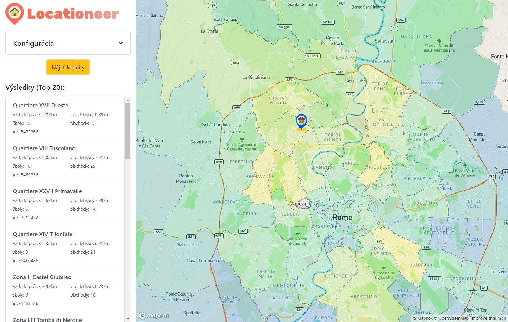
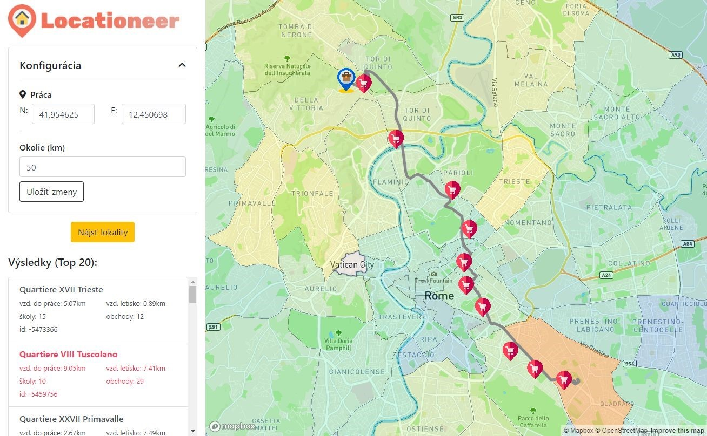

# Locationeer - Vyhľadávanie lokalít na bývanie

Opis projektu 
-------------

Aplikácia by mala slúžiť pre ľudí, ktorí sa práve rozhodujú pre nové
bývanie vo veľkomeste alebo sa práve presťahovali. Aplikácia by umožnila
vyhľadať vhodnú štvrť na bývania v okolí sídla práce. Aplikácia im tiež
zobrazí najkratšiu cestu do práce zo zvolenej štvrte pričom im zobrazí
aj sieť obchodov, ktoré by mohli cestou využiť. Tieto dve funkcionality
im pomôžu sa rozhodnúť pre konkrétnu štvrť pre finálne hľadanie
konkrétnej nehnuteľnosti.

### 1. Scenár: Vhodné štvrte v okolí práce na bývanie 



Obrazovka 1. scenáru

Používateľ definuje polohu práce a okolie, v ktorej uvažuje o bývaní v
paneli Konfigurácia (konfiguráciu môžeme vidieť na obr. 2. scenáru).
Systém následne vyhľadá všetky štvrte v špecifikovanej vzdialenosti od
polohy práce. Následne prebehne vyhodnotenie štvrte, pričom výsledné
skóre každej jednej štvrte je určené na základe týchto parametrov s
prioritou podľa uvedeného poradia:

A.  Vzdušná vzdialenosť štvrte od práce (čím väčšia tým horšie skóre)

B.  Vzdušná vzdialenosť k najbližšiemu letisku (čím väčšia tým horšie
    skóre) - uvažujeme, že daný človek kvôli práci často lieta a preto
    je pre neho výhodou bývať blízko letiska.

C.  Počet škôl (čím viac tým lepšie skóre) - Pre rodičov je problém dlhý
    čas strávený vyvážaním detí cez celé mesto, preto je pre nich výhodné mať na výber školu v priamo v ich štvrti.

D.  Počet obchodov (čím viac tým lepšie skóre)

Následne v mape vizualizujeme štvrte pričom farba je určená podľa skóre,
pričom modrá farba označuje štvrte s nízkym skóre a naopak, žltá farba
označuje štvrte s vysokým skóre.

Na bočnom paneli, môžeme vidieť aj zoznam 20 najvhodnejších štvrtí, kde
zobrazujeme aj detailné informácie o sledovaných parametroch
(vzdialenosť do práce, vzdialenosť na letisko, počet škôl a počet
obchodov).

### 2. Scenár: Najkratšia cesta do práce a sieť obchodov 

Druhý scenár sa zaoberal zase hľadaním najkratšej trasy z práce do novej
štvrte. Na hľadanie najkratšej cesty bol využitý algoritmus *Djikstra,*
​ ​pričom každú štvrť sme reprezentovali centroidom polygónu štvrte.
Informácia o najkratšej ceste umožní používateľovi reálnejší odhad
dochádzania do práce.

Okrem zobrazenia najkratšej cesty do štvrte sme vyhľadali aj všetky
obchody, ktoré sa nachádzajú vo vzdialenosti maximálne 300 metrov od
najkratšej cesty. Určite je vhodné mať popri ceste z práce alebo do
práce obchod po ceste, ktorý urýchli presun hlavne v časoch preplnenej
premávky.

Užívateľ klikne na štvrť v zozname najlepších výsledkov, pričom následne
systém vyhľadá najkratšiu trasu a sieť obchdoov popri ceste, ktoré sa
následné vizualizujú na mape, pričom zvolená štvrť sa vyznačí oranžovou
farbou. Príklad môžeme vidieť na Obrázku 2.



Obrazovka 2. scenáru

Dáta 
----

Aplikácia využíva dáta z Opeen Street Maps platforma, konrétne dáta z
kraja Lazio v Taliansku (okolie Ríma), ktoré sú voľné dostupné na
stiahnutie na stránke
[https://wiki.openstreetmap.org/wiki/Planet.osm\#Downloading{.underline}](https://wiki.openstreetmap.org/wiki/Planet.osm#Downloading).​

Vybral som si tieto dáta práve preto, že táto aplikácia má najväčší
význam práve pri prehľadávaní veľa štvrtí veľkomesta. V porovnaní s
Bratislavou má okolie Ríma 40-násobne viac štvrtí.

Architektúra aplikácie a použité knižnice 
-----------------------------------------

Aplikácia využíva architektúru klient server, pričom pozostáva z 3
komponentov, klientska webová aplikácia, server a postgres databáza.
Klientská aplikácia komunikovala prostredníctvom HTTP requestov s REST
rozhraniami, ktoré boli vystavené na aplikačnom serveri. Aplikačný
server uchovával sadu pripojení do databázy pre rýchle vyhľadávanie a
prenos dát.

### Repozitár 

Repozitáre sa nachádzajú zdrojové súbory a konfiguračné súbory.

Popis jednotlivých priečinkov v repozitári:

-   /app - Priečinok pre zdrojové súbory pre klientskú aplikáciu a
    *server*

-   /app/public - Statické súbory pre klientsku aplikáciu

-   /app/src/client - Zdrojové súbory klientskej aplikácie

-   /app/src/server - Zdrojové súbory servera

-   /db - Ukážka query a docker-compose konfigurácia pre PostgreSql a
    *PgAdmin*

### Klientska aplikácia 

Klientská webová aplikácia bola implementovaná v programovacom jazyku
Javascript s využitím knižnice ReactJS a pre vizualizácie v mape som
využil knižnicu MapboxGL JS.

### Aplikačný server 

Aplikačný server bol implementovaný využitím programovacieho jazyka
Javascript v prostredí NodeJS. Pre vystavenie REST rozhraní bola využitá
knižnica ExpressJS. Pre komunikáciu s databázou bola využitá knižnica
node-postgres.

Aplikačný server mal vystavene 2 rozhrania:

-   POST /api/v1/location/

Body:
```javascript
 {
    geoE:​ ​12.42157​,​
    geoN:​ ​41.22564​,​
    diameter:​ ​50​
 }
```
-   POST /api/v1/query/

Body:
```javascript
{
    geoE:​ ​12.42157​,
    geoN:​ ​41.22564​,​
    diameter:​ ​50​,​
    quarterId:​ ​-​574544​,​
}
```
### Databáza 

Bola použitá databáza PostgreSql 9.4 s rozšírením knižnicami Postgis 2.1
a PgRouting 2.1. Naplnenie databázy dát z OSM súborov, bolo vykonané
prostredníctvom CLI nástrojov osm2psql a osm2pgrouting. Pre manipuláciu
s databázou bol využitý nástroj PgAdmin.

Spustenie aplikácie 
-------------------

Pre spustenie aplikácie je nevyhnutné mať nainštalovaný NodeJS (verzia
10+) a Docker. Tiež je potrebné inicializovať databázu z OSM súborov.

Spustenie db a pgadmin:

```bash
cd db​
docker-compose up
```

Nainštalovanie potrebných knižníc:

```bash
cd app​
npm install​
```

Spustenie klientskej a server aplikácie pre vývoj:

```bash
cd app​
npm run dev
```
Optimalizácia vyhľadávania 
--------------------------

Pre optimalizáciu dopytov som využil viaceré techniky. Okrem klasických
indexov nad primárnymi kľúčmi a indexov nad stĺpcami používanými vo
WHERE som využil aj r-tree indexy, knn pre nájdenie najbližšieho suseda
a Djikstru pre hľadanie najkratšej cesty.

### Využívanie R-Tree indexov 

Využil som tieto r-tree indexy pre výrazné zrýchlenie filtrovania
pomocou Postgis metód ST\_CONTAINS a ST\_DWITHIN. Vyhľadávanie dosiahlo
výrazné zrýchlenie, priemerne o 400ms.

Vytvorenie indexov:


```sql
CREATE INDEX r_tree_polygon_way ON planet_osm_polygon USING gist (st_transform (way, 4326));
CREATE INDEX r_tree_point_way ON planet_osm_point USING gist ((st_transform (way, 4326)));
```

Ukážka dopytu, kde prehlľadávam štvrte v okolí 50km od bodu.

```sql
SELECT st_multi (st_collect(st_transform(way, 4326))) AS geo
FROM planet_osm_point
WHERE shop IN (
        'department_store',
        'general',
        'kiosk',
        'mall',
        'supermarket',
        'wholesale'
    )
    AND st_dwithin(
        st_transform(way, 4326)::geography,
        ST_GeogFromText('SRID=4326;POINT(12.450698 41.824625)')::geography,
        50000
    )
    AND st_dwithin(
        (
            SELECT *
            FROM multiline
        )::geography,
        st_transform(way, 4326)::geography,
```


### Využívanie KNN pre nájdenie najbližšieho suseda 

Pre vyhľadanie najbližšieho letiska od štvrte som tiež využil R-TREE
index a usporiadanie na základe vzdialenosti stredov bounding boxov,
ktoré zrýchlilo dopyt z približne 500ms na rádovo desiatky ms.

Príklad dopytu:

```sql
SELECT air.*
FROM quarters q,
    lateral (
        SELECT q.id AS qid,
            a.*,
            st_distance (q.way, a.way) AS airport_distance
        FROM airports a
        ORDER BY q.way <->a.way
        LIMIT 1
    ) air
```

### Využívanie algoritmu Djikstra pre nájdenie najkratšej cesty 

Príklad dopytu:

```sql
SELECT w.the_geom,
    id2 AS edge,
    pgr.*
FROM pgr_dijkstra (
        'SELECT gid as id, source, target, cost FROM ways',
        56,
        18452,
        FALSE,
        FALSE
    ) pgr
    INNER JOIN ways w ON w.gid = pgr.id2
```

Do dopytu posielame textu dopytu na všetky hrany v grafe, pričom
posielame aj id počiatočného a konečného bodu. Implementácia samotného
algoritmu je súčasťou knižnice PgRouting. V projekte som nemal iné
riešenie preto som to nemal ako porovnať s iným riešením.

Ukážky query scenárov 1. scenár - Štvrte 
----------------------------------------

```sql
WITH quarters AS (
    SELECT st_transform (way, 4326) AS geo,
        way,
        way_area AS area,
        place,
        name,
        osm_id AS id,
        st_distance(
            st_transform (way, 4326),
            ST_GeogFromText ('SRID=4326;POINT(12.450698	 
41.824625)')
        ) AS distance
    FROM planet_osm_polygon p
    WHERE p.place IN ('quarter', 'suburb', 'village')
        AND st_dwithin (
            st_transform (way, 4326)::geography,
            ST_GeogFromText('SRID=4326;POINT(12.450698 41.824625)')::geography,
            50000
        )
),
airports AS (
    SELECT st_transform (way, 4326) AS geo,
        name,
        aeroway,
        way
    FROM planet_osm_polygon p
    WHERE aeroway IN ('aerodrome')
        AND (
            landuse <> 'military'
            OR landuse IS NULL
        )
        AND st_dwithin (
            st_transform (way, 4326)::geography,
            ST_GeogFromText('SRID=4326;POINT(12.450698 41.824625)')::geography,
            50000
        )
),
closestairports AS (
    SELECT air.*
    FROM quarters q,
        lateral (
            SELECT q.id AS qid,
                a.*,
                st_distance (q.way, a.way) AS airport_distance
            FROM airports a
            ORDER BY q.way <->a.way
            LIMIT 1
        ) air
), schools AS (
    SELECT q.id AS qid,
        COUNT (scho.osm_id) AS schools
    FROM quarters q
        JOIN (
            SELECT st_transform (way, 4326) AS geo,
                name,
                shop,
                *
            FROM planet_osm_polygon
            WHERE amenity = 'school'
                AND name IS NOT NULL
                AND st_dwithin (
                    st_transform (way, 4326)::geography,
                    ST_GeogFromText('SRID=4326;POINT(12.450698 41.824625)')::geography,
                    50000
                )
        ) scho ON ST_Contains (q.way, scho.way)
    GROUP BY q.id
),
shops AS (
    SELECT q.id AS qid,
        COUNT (shop.osm_id) AS shops
    FROM quarters q
        JOIN (
            SELECT st_transform (way, 4326) AS geo,
                way,
                name,
                shop,
                osm_id
            FROM planet_osm_point
            WHERE shop IN (
                    'department_store',
                    'general',
                    'kiosk',
                    'mall',
                    'supermarket',
                    'wholesale'
                )
                AND st_dwithin (
                    st_transform (way, 4326)::geography,
                    ST_GeogFromText('SRID=4326;POINT(12.450698 41.824625)')::geography,
                    50000
                )
        ) shop ON ST_Contains (q.way, shop.way)
    GROUP BY q.id
),
mergedquarters AS (
    SELECT q.geo,
        q.way,
        q.id,
        q.name,
        q.area,
        CASE
            WHEN q.distance > 10000 THEN 10000
            ELSE COALESCE (q.distance, 10000)
        END AS distance,
        CASE
            WHEN ca.airport_distance > 20000 THEN 20000
            ELSE COALESCE(ca.airport_distance, 20000)
        END AS airprt,
        COALESCE(schools, 0) AS schls,
        COALESCE(shops, 0) AS shps
    FROM quarters q
        LEFT JOIN schools s ON s.qid = q.id
        LEFT JOIN shops sh ON sh.qid = q.id
        LEFT JOIN closestairports ca ON ca.qid = q.id
)
SELECT ST_AsGeoJSON (q.geo) AS wayGeo,
    q.geo,
    q.id,
    q.name,
    q.area,
    q.schls AS schools,
    q.airprt AS airportDistance,
    q.shps AS shops,
    q.distance,
    (
        ((10000 - distance) / 250) + schls * 3 + shps + (20000 - airprt) / 2000
    ) AS score
FROM mergedquarters q
ORDER BY score DESC
```

2.scenár - Najkratšia cesta 
---------------------------

```sql
WITH workNearestPoint AS (
    SELECT v.id,
        v.the_geom
    FROM ways_vertices_pgr v
    ORDER BY st_transform (v.the_geom, 4326) <->ST_GeogFromText ('SRID=4326;POINT(12.450698	 
41.824625)')
    LIMIT 1
), startline AS (
    SELECT st_makeline (
            ST_GeogFromText ('SRID=4326;POINT(12.450698 41.824625)')::geometry,
            v.the_geom
        ) AS strtline
    FROM workNearestPoint v
),
areaCentroid AS (
    SELECT ST_Centroid (st_transform (p.way, 4326)) AS geo
    FROM planet_osm_polygon p
    WHERE p.osm_id = -5473394
    LIMIT 1
), selectedAreaPoint AS (
    SELECT vert.id
    FROM areacentroid a
        JOIN LATERAL (
            SELECT *
            FROM ways_vertices_pgr v
            ORDER BY st_transform (v.the_geom, 4326) <->a.geo
            LIMIT 1
        ) vert ON TRUE
    LIMIT 1
), pointids AS (
    SELECT *
    FROM (
            VALUES (
                    (
                        SELECT MAX (id)
                        FROM worknearestpoint
                    )
                ),
                (
                    (
                        SELECT MAX (id)
                        FROM selectedareapoint
                    )
                )
        ) AS points (id)
),
line AS (
    SELECT w.the_geom,
        id2 AS edge,
        pgr.*
    FROM pgr_astar (
            'SELECT gid as id, source, target, cost FROM ways',
            (
                SELECT MIN (id)
                FROM pointids
            )::INTEGER,
            (
                SELECT MAX (id)
                FROM pointids
            )::INTEGER,
            FALSE,
            FALSE
        ) pgr
        INNER JOIN ways w ON w.gid = pgr.id2
    UNION
    VALUES (
            (
                SELECT *
                FROM startline
            ),
            0,
            0,
            NULL::BIGINT,
            NULL::BIGINT,
            0,
            0
        )
),
multiline AS (
    SELECT st_linemerge (st_multi (st_collect (the_geom))) AS geo
    FROM line
),
shops AS (
    SELECT st_multi (st_collect (st_transform (way, 4326))) AS geo
    FROM planet_osm_point
    WHERE shop IN (
            'department_store',
            'general',
            'kiosk',
            'mall',
            'supermarket',
            'wholesale'
        )
        AND st_dwithin (
            st_transform (way, 4326)::geography,
            ST_GeogFromText('SRID=4326;POINT(12.450698 41.824625)')::geography,
            50000
        )
        AND st_dwithin (
            (
                SELECT *
                FROM multiline
            )::geography,
            st_transform (way, 4326)::geography,
            300
        )
)
SELECT ST_AsGeoJSON (m.geo) AS line,
    m.geo,
    ST_AsGeoJSON (s.geo) AS shops
FROM multiline m
    JOIN shops s ON TRUE
```